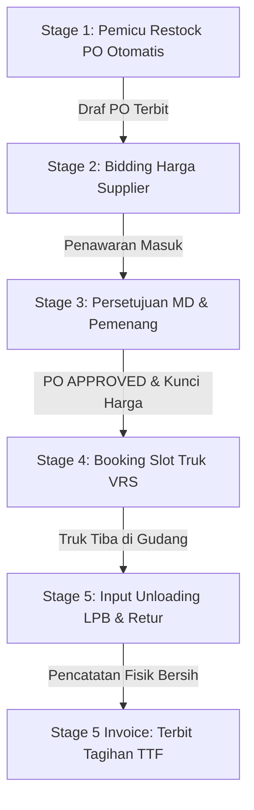

# 📖 Dokumentasi Lengkap Sistem Informasi B2B AmandaMart
*(Panduan Komprehensif Alur Kerja, Keamanan, Modul, dan Teknis untuk Laporan Magang)*

Selamat datang di file dokumentasi resmi **Sistem Informasi Manajemen Rantai Pasok B2B (Business-to-Business) AmandaMart**. Dokumen ini dirancang sebagai panduan komprehensif bagi developer, administrator, maupun pembaca laporan magang untuk memahami secara mendalam cara kerja, arsitektur, modul utama, alur kerja sistem, skema database, serta integrasi teknis aplikasi secara keseluruhan.

---

## 📌 Daftar Isi
1. [Tentang Sistem B2B AmandaMart](#-tentang-sistem-b2b-amandamart)
2. [Fitur & Modul Utama Aplikasi](#-fitur--modul-utama-aplikasi)
3. [Arsitektur & Teknologi](#-arsitektur--teknologi)
4. [Alur Kerja Sistem (5-Stage Supply Chain Workflow)](#-alur-kerja-sistem-5-stage-supply-chain-workflow)
5. [Keamanan & Multi-Factor Authentication (2FA TOTP)](#-keamanan--multi-factor-authentication-2fa-totp)
6. [Skema Database & Relasi Tabel](#-skema-database--relasi-tabel)
7. [Panduan Instalasi (Installation Guide)](#-panduan-instalasi-installation-guide)
8. [Panduan Menjalankan Sistem & Simulasi](#-panduan-menjalankan-sistem--simulasi)
9. [Pengujian Otomatis (Automated Testing)](#-pengujian-otomatis-automated-testing)

---

## 🏢 Tentang Sistem B2B AmandaMart

**AmandaMart B2B Portal** adalah platform kolaborasi rantai pasok terintegrasi yang menghubungkan **Tim Merchandiser (MD)** AmandaMart dengan **Supplier / Vendor Rekanan** secara langsung.

Sistem ini memfasilitasi koordinasi dan otomatisasi pengadaan barang ritel dari mulai pendeteksian stok kritis di Distribution Center (DC) utama, proses penawaran lelang (*bidding*), penjadwalan antrean kendaraan logistik, hingga penerimaan fisik barang masuk, manajemen retur barang rusak, serta penerbitan faktur tagihan keuangan secara bersih dan akurat.

### Tujuan Utama Sistem:
* **Mencegah Out-of-Stock (OOS)**: Deteksi otomatis stok kritis di bawah kapasitas gudang maksimum guna memicu restok tepat waktu.
* **Efisiensi Biaya Pengadaan (Bidding System)**: Supplier bersaing menawarkan harga modal terbaik secara transparan untuk memenangkan kuota PO.
* **Manajemen Antrean Logistik (VRS)**: Reservasi kedatangan truk teratur guna mencegah penumpukan kendaraan di gudang DC.
* **Akurasi Finansial (LPB & TTF)**: Pembayaran faktur berbasis jumlah fisik bersih yang tiba setelah dikurangi retur barang cacat.

---

## 🌟 Fitur & Modul Utama Aplikasi

Sistem informasi B2B AmandaMart memiliki beberapa modul fungsional utama:

### 1. Dasbor Berbasis Peran (Role-Based Dashboard Layout)
* **Left Sidebar Navigation**: Antarmuka dasbor enterprise modern dengan menu samping kiri yang ringkas, responsif, dan terorganisir berdasarkan kategori aktivitas (Utama, Transaksi, Analitik, Akun).
* **Profile Bubbles**: Penanda identitas visual dengan inisial nama akun berwarna gradien biru safir (untuk MD) atau emerald zamrud (untuk Supplier) di atas sidebar.
* **Notification Badges**: Indikator angka notifikasi merah (jumlah stok kritis, draf PO menunggu bidding, slot VRS kosong, atau LPB tertunda) langsung di sebelah item menu sidebar yang bersangkutan secara real-time.
* **Dark / Light Mode Persisten**: Pengalihan tema malam/siang menggunakan tombol toggle yang statusnya tersimpan rapi di `localStorage` peramban.

### 2. Modul Master Produk & Stok DC (MD Portal)
* Memantau daftar inventori produk ritel beserta kode PLU, tingkat stok saat ini (`on_hand`), batas minimum safety stock (`minor`), dan kapasitas gudang maksimum (`max_stock`).
* Deteksi stok kritis akurat. Status produk tetap berada pada kondisi **"Kritis / Butuh PO"** selama PO sedang diproses, dan baru akan diperbarui menjadi **"Aman"** ketika fisik barang benar-benar diterima di Distribution Center (DC).

### 3. Modul Bidding Penawaran Harga (Supplier Portal)
* Menampilkan daftar draf PO yang terbuka untuk bidding penawaran.
* **Bulk Offer Submission**: Memungkinkan sales supplier menginput penawaran harga modal terbaik per PCS secara kolektif untuk seluruh antrean PO sekaligus melalui satu tombol kirim final.

### 4. Modul Bidding & Approval MD (MD Portal)
* MD meninjau semua penawaran masuk dari berbagai sales vendor secara terpusat.
* **AJAX No-Refresh Approval**: Proses persetujuan menggunakan Fetch API AJAX sehingga baris PO memudar perlahan (*fade-out*) dan terhapus dari DOM secara instan setelah disetujui tanpa memicu penyegaran (*refresh*) layar.
* **Kunci Harga & Vendor**: Setelah disetujui, harga modal dan vendor terpilih dikunci di database, serta sistem menolak penawaran dari vendor lain secara otomatis.

### 5. Modul Registrasi Antrean Kendaraan (VRS - Vehicle Reservation System)
* **Bulk VRS Booking**: Supplier pemenang PO dapat mendaftarkan rencana kedatangan armada truk mereka dengan memilih Tanggal dan Slot Waktu secara kolektif untuk semua PO sekaligus.
* **Quota Control**: Kapasitas penerimaan dibatasi maksimal **5 truk per slot waktu** per hari untuk menghindari kemacetan antrean di pintu bongkar muat DC.

### 6. Modul Laporan Penerimaan Barang (LPB) & Retur
* Petugas gudang mencatat kedatangan fisik barang riil, barcode produk, waktu unloading, serta mencatat jumlah produk retur (cacat/rusak) beserta alasannya.
* Menggunakan **Database Transaction** (blok transaksi DB) untuk menjamin pembaruan data stok `on_hand` produk secara aman dan konsisten.

### 7. Modul Tanda Terima Faktur (TTF Invoice)
* Konversi LPB menjadi berkas keuangan tagihan bersih secara otomatis.
* Kalkulasi nilai bayar bersih:
  $$\text{Total Bayar} = (\text{Jumlah Diterima} \times \text{Harga Modal Final}) - (\text{Jumlah Retur} \times \text{Harga Modal Final})$$
* Status pembayaran disetujui dengan tenggat waktu jatuh tempo transfer T+14 Hari Kerja.
* **Print-Friendly Views**: Berkas LPB dan TTF dilengkapi dengan gaya CSS cetak (`@media print`) sehingga ramah-cetak ketika dicetak ke kertas fisik atau disimpan sebagai dokumen PDF.

### 8. Modul WhatsApp Hubungi MD (Supplier Portal)
* Menyediakan tombol pintasan **"Hubungi MD (WA)"** langsung ke nomor WhatsApp MD menggunakan tautan `wa.me`.
* Tombol ini dilengkapi pesan otomatis berisi nama supplier bersangkutan. Diletakkan pada sidebar kiri navigasi dan welcome banner dasbor utama supplier agar dapat diakses kapan saja.

---

## 🛠️ Arsitektur & Teknologi

* **Framework Backend**: Laravel (PHP 8.2+) dengan arsitektur MVC (Model-View-Controller).
* **Database**: PostgreSQL (atau SQLite untuk lokal) dengan dukungan integrasi stored procedures, foreign key constraints, dan transaction block.
* **Front-end**: HTML5, CSS3, Tailwind CSS (via CDN) dengan dukungan **Dark / Light Mode** yang tersimpan di `localStorage` peramban.
* **Interaktivitas AJAX**: JavaScript Vanilla dengan Fetch API untuk memproses transaksi dinamis tanpa reload halaman (seperti MD Approval, LPB bongkar, dan TTF Invoice).
* **Keamanan Multi-Factor**: Google Authenticator TOTP (Time-Based One-Time Password) untuk keamanan MD.
* **Notifikasi Saluran Luar**: Integrasi dispatch notifikasi berkala (simulasi WhatsApp) berbasis data kontak supplier.

---

## 🔄 Alur Kerja Sistem (5-Stage Supply Chain Workflow)

Operasional rantai pasok B2B AmandaMart terbagi menjadi 5 tahap terintegrasi:



### 1. Stage 1: Deteksi Stok Kritis & Restock Otomatis
* Sistem memantau stok produk di gudang DC. Apabila stok fisik (`on_hand`) berada di bawah batas maksimal, status produk menjadi butuh PO.
* Tombol **Generate PO Otomatis** pada MD Dashboard memicu Stored Procedure database `generate_auto_po_proc`.
* Prosedur ini membuat Purchase Order (PO) baru berstatus `PENDING_BIDDING` dengan kuantitas:
  $$\text{Qty PO} = \text{Max Stock} - \text{Stok Fisik Saat Ini}$$
  Kuantitas pesanan dikunci mutlak oleh sistem.

### 2. Stage 2: Proses Bidding Penawaran Harga (Supplier Portal)
* Supplier rekanan melihat draf PO yang terbuka untuk bidding.
* Akun sales supplier menginput penawaran harga modal terbaik per PCS untuk item terkait secara kolektif (bulk submission).

### 3. Stage 3: Persetujuan Pemenang (MD Approval)
* Tim MD melihat semua penawaran masuk dari sales berbagai vendor di panel bidding.
* MD membandingkan harga dan menyetujui sales yang menawarkan harga termurah.
* Proses persetujuan (approval) menggunakan Fetch AJAX sehingga baris PO memudar dan diperbarui di layar MD secara instan tanpa reload halaman penuh. PO berubah status menjadi `APPROVED` dan harga terkunci.

### 4. Stage 4: Logistik & Reservasi Antrean Truk (VRS Booking)
* Sales supplier pemenang PO mendaftarkan rencana kedatangan truk pengiriman di portal VRS secara bulk (kolektif).
* **Quota Control**: Kapasitas bongkar muat gudang dibatasi maksimal **5 truk** per slot waktu per hari kerja. Jika penuh, supplier harus memilih slot waktu lain.

### 5. Stage 5: Input Fisik LPB & Retur Cacat (Goods Receipt)
* Ketika truk tiba di DC, petugas gudang memverifikasi barcode barang, mencatat waktu unloading riil, serta memasukkan jumlah fisik produk yang diterima.
* Jika ada produk rusak/cacat, petugas mencatat jumlah retur beserta alasannya.
* Sistem menggunakan **Database Transaction** secara aman untuk memperbarui stok DC utama serta memicu pembuatan data retur.

### 6. Stage 5 Invoice: Penerbitan Tanda Terima Faktur (TTF)
* Berkas LPB dikonversi oleh tim MD menjadi dokumen penagihan resmi **Tanda Terima Faktur (TTF)**.
* Nilai tagihan dihitung otomatis:
  $$\text{Total Bayar} = (\text{Jumlah Diterima} \times \text{Harga Modal Final}) - (\text{Jumlah Retur} \times \text{Harga Modal Final})$$
* Status pembayaran diatur ke `pending` dan akan ditransfer ke rekening vendor dalam waktu **T+14 Hari Kerja**.

---

## 👥 Keamanan & Multi-Factor Authentication (2FA TOTP)

Sistem membagi hak akses ke dalam dua peran utama dengan keamanan ketat:

### 1. Tim Internal Merchandiser (MD) dengan Google 2FA
* Wajib mengaktifkan **2FA Google Authenticator**. Setelah memasukkan password, pengguna MD harus memasukkan kode 6 digit dari aplikasi di HP untuk login.
* **Perbaikan Visual Setup**: Sistem menghilangkan atribut `autofocus` dari field input OTP di halaman setup 2FA. Hal ini mencegah browser melakukan scroll otomatis ke bawah saat halaman dimuat, sehingga petunjuk setup dan gambar QR Code di bagian atas halaman tidak lagi terpotong (*cut-off*) dan dapat dibaca dengan jelas sejak awal pemuatan halaman.

### 2. Akun Rekanan Supplier / Vendor (Sales)
* Terdiri dari 5 Supplier resmi (PT Unilever Indonesia, PT Indofood CBP, PT Wings Surya, PT Mayora Indah, dan PT Nestle Indonesia). Setiap supplier memiliki 5 akun sales terpisah.
* **Isolasi Data**: Setiap akun sales diisolasi secara ketat dan hanya dapat melihat, menawarkan lelang, serta menjadwalkan VRS untuk produk dari perusahaannya sendiri.

---

## 🗄️ Skema Database & Relasi Tabel

* **`users`**: Menyimpan kredensial pengguna, peran (`role` = `md` atau `supplier`), kode rahasia 2FA (`google_2fa_secret`), dan relasi ke `suppliers`.
* **`suppliers`**: Menyimpan profil perusahaan vendor rekanan, kode vendor resmi (misal: `SUP-001`), dan nomor WhatsApp logistik.
* **`products`**: Data inventori produk ritel, kode PLU unik, kuantitas saat ini (`on_hand`), stok minimum (`minor`), dan kapasitas maksimum (`max_stock`).
* **`purchase_orders`**: Transaksi pesanan, mencatat nomor PO unik (`po_number`), produk, kuantitas order, status PO, dan tenggat waktu pengiriman.
* **`offers`**: Penawaran harga modal masuk dari sales supplier rekanan untuk PO tertentu.
* **`vrs_schedules`**: Data booking slot truk logistik pengiriman barang ke DC.
* **`goods_receipts`**: Laporan Penerimaan Barang (LPB) fisik tiba di gudang.
* **`returs`**: Pencatatan penalti pemotongan produk cacat/rusak saat unloading.
* **`ttfs`**: Faktur tanda terima tagihan pembayaran bersih.

---

## ⚙️ Panduan Instalasi (Installation Guide)

### Prasyarat
* **PHP** versi 8.2 atau lebih baru
* **Composer** (Manajer Dependensi PHP)
* **PostgreSQL / SQLite** (Sebagai database server)

### Langkah Setup
1. **Clone Project**:
   ```bash
   git clone <url-repositori-anda> amandasmart-b2b
   cd amandasmart-b2b
   ```
2. **Install Dependensi PHP**:
   ```bash
   composer install
   ```
3. **Konfigurasi Environment (`.env`)**:
   ```bash
   cp .env.example .env
   ```
   Buka berkas `.env` baru Anda, sesuaikan koneksi database. Contoh untuk SQLite:
   ```env
   DB_CONNECTION=sqlite
   ```
4. **Generate App Key**:
   ```bash
   php artisan key:generate
   ```
5. **Migrasi Database & Seeding Data**:
   ```bash
   php artisan migrate:fresh --seed
   ```

---

## 🚀 Panduan Menjalankan Sistem & Simulasi

### 1. Menjalankan Web Server Lokal
Jalankan server pengembangan bawaan Laravel:
```bash
php artisan serve
```
Buka peramban (browser) dan akses alamat: `http://127.0.0.1:8000`

### 2. Kredensial Masuk Akun Uji Coba
* **Akun MD**: Username `rendi_md` / Password `password123`
* **Akun Supplier**: Username `unilever_sales1` (atau `indofood_sales1`, `wings_sales1`, `mayora_sales1`, `nestle_sales1`) / Password `password123`

### 3. Menjalankan CLI Simulasi Transaksi Ritel
Untuk menyimulasikan siklus penuh 5 tahap rantai pasok B2B secara otomatis tanpa perlu menginput formulir satu per satu lewat browser, jalankan command:
```bash
php artisan amandamart:simulasi
```
Perintah ini akan secara mandiri menjalankan simulasi deteksi stok kritis, pembuatan PO, penawaran bidding otomatis, persetujuan penawaran terendah, pembuatan reservasi truk VRS, pengisian LPB fisik & retur, hingga penerbitan TTF invoice tagihan keuangan bersih.

---

## 🧪 Pengujian Otomatis (Automated Testing)

Aplikasi memiliki pengujian terintegrasi menggunakan PHPUnit untuk memvalidasi kestabilan sistem:
* **Perintah Uji**:
  ```bash
  php artisan test
  ```
* **Hasil**: Seluruh **14 skenario pengujian (125 assertions)** berhasil lulus (*PASSED*) secara konsisten untuk memastikan tidak ada fungsionalitas sistem yang rusak setelah pembaruan kode.

---

## 🤖 10. AI Prompt Penulisan Laporan Magang (Konteks Chat untuk Gemini/LLM)

Jika Anda ingin meminta bantuan AI Assistant (seperti Gemini, ChatGPT, Claude, dll.) untuk **menyusun atau menyempurnakan bab-bab pada Laporan Magang** Anda, silakan salin dan tempelkan teks prompt di bawah ini ke sesi chat baru Anda:

```text
Anda adalah seorang Dosen Pembimbing Magang dan Penulis Akademik Profesional. Saya sedang menyusun naskah "Laporan Magang/Praktek Kerja Lapangan (PKL)" mengenai proyek pengembangan "Sistem Informasi Manajemen Rantai Pasok B2B (Business-to-Business) AmandaMart". 

Tugas Anda adalah membantu saya menyusun draf konten paragraf untuk bab-bab laporan magang saya berdasarkan deskripsi sistem di bawah ini. Harap tulis dengan gaya penulisan ilmiah bahasa Indonesia formal akademis (EYD/PUEBI, objektif, logis, dan analitis).

---
KONTEKS SISTEM PORTAL B2B AMANDAMART:

1. TUJUAN & LATAR BELAKANG SISTEM:
Sistem ini dibuat untuk menghubungkan tim internal Merchandiser (MD) AmandaMart dengan Supplier rekanan secara real-time. Tujuannya adalah mengotomatisasi proses restok barang ritel, memfasilitasi lelang penawaran (bidding) harga modal terbaik dari supplier, mencegah penumpukan truk bongkar muat di gudang Distribution Center (DC), mencatat penerimaan fisik barang bersih secara akurat, serta menerbitkan nota tagihan keuangan (TTF) bersih setelah dikurangi retur barang rusak.

2. FITUR UTAMA SISTEM:
- Dasbor Modern Left Sidebar responsif dengan visual Profile Bubbles, badges notifikasi real-time, dan toggle Light/Dark Mode persisten.
- Modul Master Produk & Stok DC: menampilkan PLU Code, stok on hand, safety stock (minor), dan max stock.
- Modul Bidding Penawaran Harga (Supplier Portal): penyerahan harga penawaran secara kolektif (bulk submission).
- Modul Approval MD: persetujuan pemenang penawaran harga modal termurah secara dinamis dengan AJAX Fetch API (DOM fade-out no-refresh).
- Modul Logistik VRS (Vehicle Reservation System): reservasi jadwal truk secara bulk dengan kontrol kuota (maksimal 5 truk per slot waktu).
- Modul LPB & Retur: pencatatan penerimaan fisik dan retur barang cacat menggunakan DB Transaction.
- Modul Faktur TTF (Tanda Terima Faktur): kalkulasi otomatis tagihan bersih (Qty Diterima - Qty Retur) * Harga Modal Final dengan tempo pembayaran T+14 Hari Kerja.
- Modul WhatsApp MD: tombol pintasan chat WhatsApp MD di welcome banner dan sidebar portal supplier.
- Keamanan: Otentikasi dua langkah (2FA Google Authenticator TOTP) wajib untuk peran MD.

3. TEKNOLOGI YANG DIGUNAKAN:
- Framework Backend: Laravel 13 (PHP 8.2+).
- Database: PostgreSQL/SQLite dengan Stored Procedure (generate_auto_po_proc) untuk auto-create PO.
- Frontend: HTML5, CSS3, Tailwind CSS, JavaScript Vanilla (AJAX Fetch API).
- Pengujian: Automated Feature & Unit Tests (14 passed, 125 assertions) dan CLI Simulasi Rantai Pasok (`php artisan amandamart:simulasi`).

---
INSTRUKSI PENULISAN LAPORAN:
Bantu saya membuat draf tulisan untuk bab yang saya minta (misalnya Bab I Pendahuluan, Bab II Landasan Teori, Bab III Analisis Sistem, Bab IV Pembahasan/Implementasi, atau Bab V Kesimpulan). 

Setiap kali saya meminta Anda menulis bagian bab tertentu, gunakan konteks di atas untuk mengembangkan penjelasan yang detail, berbobot, ilmiah, dan relevan dengan format penulisan laporan magang akademik pada umumnya.

Sebagai respon pertama, silakan sapa saya, nyatakan kesiapan Anda untuk menulis laporan magang B2B AmandaMart ini, dan tanyakan bab mana yang ingin ditulis terlebih dahulu.
```

---
*Dokumentasi ini disusun secara detail dan akurat untuk menunjang kelengkapan penulisan laporan magang kelulusan.*
