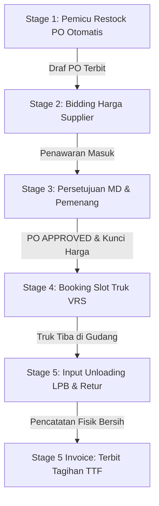

# 📖 Dokumentasi Lengkap Sistem Informasi B2B AmandaMart

Selamat datang di file dokumentasi resmi **Sistem Informasi Manajemen Rantai Pasok B2B (Business-to-Business) AmandaMart**. Dokumen ini dirancang sebagai panduan komprehensif bagi developer, administrator, maupun pengguna sistem untuk memahami cara kerja, arsitektur, proses instalasi, pengujian, serta pengoperasian sistem secara keseluruhan.

---

## 📌 Daftar Isi
1. [Tentang Sistem B2B AmandaMart](#-tentang-sistem-b2b-amandamart)
2. [Arsitektur & Teknologi](#-arsitektur--teknologi)
3. [Alur Kerja Sistem (5-Stage Supply Chain Workflow)](#-alur-kerja-sistem-5-stage-supply-chain-workflow)
4. [Peran Pengguna & Keamanan (Role & 2FA TOTP)](#-peran-pengguna--keamanan-role--2fa-totp)
5. [Skema Database & Relasi](#-skema-database--relasi)
6. [Panduan Instalasi (Installation Guide)](#-panduan-instalasi-installation-guide)
7. [Panduan Menjalankan Sistem (Usage Guide)](#-panduan-menjalankan-sistem-usage-guide)
8. [Pengujian & Simulasi Otomatis](#-pengujian--simulasi-otomatis)

---

## 🏢 Tentang Sistem B2B AmandaMart

**AmandaMart B2B Portal** adalah platform kolaborasi rantai pasok terintegrasi yang menghubungkan **Tim Merchandiser (MD)** AmandaMart dengan **Supplier / Vendor Rekanan** secara langsung. 

Sistem ini memfasilitasi otomasi pengadaan barang ritel dari deteksi stok kritis di Distribution Center (DC) utama hingga pengiriman fisik barang, penanganan retur produk cacat, dan penerbitan nota keuangan tagihan secara otomatis. 

### Tujuan Utama Sistem:
* **Mencegah Out-of-Stock (OOS)**: Deteksi otomatis stok kritis guna restok tepat waktu.
* **Mencegah Overstock (Kelebihan Pasokan)**: Kuantitas restok dikunci berdasarkan batas maksimum kapasitas gudang.
* **Efisiensi Biaya (Bidding System)**: Supplier bersaing menawarkan harga modal terbaik secara transparan.
* **Manajemen Antrean Logistik (VRS)**: Reservasi kedatangan truk teratur guna mencegah penumpukan kendaraan di gudang DC.
* **Akurasi Finansial (LPB & TTF)**: Pembayaran faktur berbasis jumlah fisik bersih yang tiba setelah dikurangi denda retur.

---

## 🛠️ Arsitektur & Teknologi

Sistem dikembangkan menggunakan arsitektur web modern yang decoupled, berkinerja tinggi, dan responsif:

* **Framework Backend**: Laravel (PHP 8.2+) dengan arsitektur MVC (Model-View-Controller).
* **Database**: PostgreSQL (atau SQLite untuk lokal) dengan dukungan integrasi stored procedures, foreign key constraints, dan transaction block.
* **Front-end**: HTML5, CSS3, Tailwind CSS (via CDN) dengan dukungan **Dark / Light Mode** yang tersimpan di `localStorage` peramban.
* **Interaktivitas AJAX**: JavaScript Vanilla dengan Fetch API untuk memproses transaksi dinamis tanpa reload halaman (seperti MD Approval, LPB bongkar, dan TTF Invoice).
* **Keamanan Multi-Factor**: Google Authenticator TOTP (Time-Based One-Time Password) untuk keamanan MD.
* **Notifikasi Saluran Luar**: Integrasi dispatch notifikasi berkala (simulasi WhatsApp) berbasis data kontak supplier.

---

## 🔄 Alur Kerja Sistem (5-Stage Supply Chain Workflow)

Operasional rantai pasok B2B AmandaMart terbagi menjadi 5 tahap terintegrasi:



### 1. Stage 1: Deteksi Stok Kritis & Restock Otomatis (PB)
* Sistem memantau stok produk di Distribution Center (DC). Apabila `on_hand` (stok fisik) turun di bawah nilai `minor` (safety stock), status produk menjadi kritis.
* Tombol **Generate PO Otomatis** pada MD Dashboard memicu Stored Procedure database `generate_auto_po_proc`.
* Prosedur ini membuat Purchase Order (PO) baru berstatus `PENDING_BIDDING` dengan kuantitas:
  $$\text{Qty PO} = \text{Max Stock} - \text{Stok Fisik Saat Ini}$$
  Kuantitas pesanan dikunci mutlak oleh sistem.

### 2. Stage 2: Proses Bidding Penawaran Harga (Supplier Portal)
* Supplier rekanan melihat draf PO yang terbuka untuk bidding.
* Akun sales supplier menginput penawaran harga modal terbaik per PCS untuk item terkait secara kolektif (bulk submission).

### 3. Stage 3: Persetujuan Pemenang (MD Approval)
* Tim MD melihat semua penawaran masuk dari sales berbagai vendor di panel bidding.
* MD membandingkan harga dan menyetujui sales yang menawarkan harga termurah.
* Proses persetujuan (approval) menggunakan Fetch AJAX sehingga baris PO memudar dan diperbarui di layar MD secara instan tanpa reload halaman penuh. PO berubah status menjadi `APPROVED` dan harga terkunci.

### 4. Stage 4: Logistik & Reservasi Antrean Truk (VRS Booking)
* Sales supplier pemenang PO mendaftarkan rencana kedatangan truk pengiriman di portal VRS.
* **Quota Control**: Kapasitas bongkar muat gudang dibatasi maksimal **5 truk** per slot waktu per hari kerja. Jika penuh, supplier harus memilih slot waktu lain.

### 5. Stage 5: Input Fisik LPB & Retur Cacat (Goods Receipt)
* Ketika truk tiba di DC, petugas gudang memverifikasi barcode barang, mencatat waktu unloading riil, serta memasukkan jumlah fisik produk yang diterima.
* Jika ada produk rusak/cacat, petugas mencatat jumlah retur beserta alasannya.
* Sistem menggunakan **Database Transaction** secara aman untuk memperbarui stok DC utama serta memicu pembuatan data retur.

### 6. Stage 5 Invoice: Penerbitan Tanda Terima Faktur (TTF)
* Berkas LPB dikonversi oleh tim MD menjadi dokumen penagihan resmi **Tanda Terima Faktur (TTF)**.
* Nilai tagihan dihitung otomatis:
  $$\text{Total Bayar} = (\text{Jumlah Diterima} \times \text{Harga Modal Final}) - (\text{Jumlah Retur} \times \text{Harga Modal Final})$$
* Status pembayaran diatur ke `pending` dan akan ditransfer ke rekening vendor dalam waktu **T+14 Hari Kerja**.

---

## 👥 Peran Pengguna & Keamanan (Role & 2FA TOTP)

Sistem membagi hak akses ke dalam dua peran utama dengan isolasi data yang ketat:

### 1. Tim Internal Merchandiser (MD)
* **Wewenang**: Mengelola master produk, menyetujui penawaran lelang bidding, memantau VRS, menginput data LPB gudang, dan menerbitkan TTF invoice keuangan.
* **Keamanan 2FA**: Wajib mengaktifkan **Google Authenticator MFA**. Setelah login pertama kali dengan password, MD harus memindai kode QR 2FA melalui aplikasi Authenticator di ponsel untuk mendapatkan kode verifikasi 6 digit sekali pakai (TOTP) setiap kali masuk.

### 2. Akun Rekanan Supplier / Vendor
* **Struktur Akun**: Terdiri dari 5 Supplier resmi (PT Unilever Indonesia, PT Indofood CBP, PT Wings Surya, PT Mayora Indah, dan PT Nestle Indonesia). Setiap supplier memiliki 5 akun sales terpisah (misal: `unilever_sales1` s.d. `unilever_sales5`).
* **Isolasi Data**: Setiap sales hanya dapat melihat data penawaran bidding produk milik perusahaan mereka sendiri, melacak antrean truk milik armada mereka, serta melihat LPB dan TTF pembayaran yang mereka menangkan. Data performa service level tidak diperlihatkan di dashboard sales guna kenyamanan kemitraan.

---

## 🗄️ Skema Database & Relasi

Sistem didesain dengan skema database relasional yang ternormalisasi:

* **`users`**: Menyimpan kredensial masuk pengguna, peran (`role` = `md` atau `supplier`), kode rahasia 2FA (`google_2fa_secret`), dan relasi ke `suppliers`.
* **`suppliers`**: Menyimpan profil perusahaan vendor rekanan, kode vendor resmi (misal: `SUP-001`), dan nomor WhatsApp dispatch logistik.
* **`products`**: Data inventori produk ritel, kode PLU unik, kuantitas saat ini (`on_hand`), stok minimum (`minor`), dan kapasitas maksimum (`max_stock`).
* **`purchase_orders`**: Header pesanan, mencatat nomor PO unik (`po_number`), produk, kuantitas order, status PO, dan tenggat waktu pengiriman.
* **`offers`**: Penawaran harga modal masuk dari sales supplier rekanan untuk PO tertentu.
* **`vrs_schedules`**: Data booking slot truk logistik pengiriman barang ke DC.
* **`goods_receipts`**: Laporan Penerimaan Barang (LPB) fisik tiba di gudang.
* **`returs`**: Pencatatan penalti pemotongan produk cacat/rusak saat unloading.
* **`ttfs`**: Faktur tanda terima tagihan pembayaran bersih.

---

## ⚙️ Panduan Instalasi (Installation Guide)

Ikuti langkah-langkah di bawah ini untuk memasang project di lingkungan lokal Anda:

### Prasyarat
Pastikan sistem operasi Anda telah terpasang:
* **PHP** versi 8.2 atau lebih baru
* **Composer** (Manajer Dependensi PHP)
* **Node.js & NPM** (Optional, jika memerlukan kompilasi aset front-end)
* **PostgreSQL / SQLite** (Sebagai database server)

### Langkah Setup

1. **Clone Project**:
   Salin repositori project ke penyimpanan lokal Anda:
   ```bash
   git clone <url-repositori-anda> amandasmart-b2b
   cd amandasmart-b2b
   ```

2. **Install Dependensi PHP**:
   Unduh pustaka vendor framework Laravel menggunakan Composer:
   ```bash
   composer install
   ```

3. **Konfigurasi Environment (`.env`)**:
   Salin template berkas konfigurasi bawaan Laravel:
   ```bash
   cp .env.example .env
   ```
   Buka berkas `.env` baru Anda, sesuaikan koneksi database. Contoh untuk SQLite:
   ```env
   DB_CONNECTION=sqlite
   ```
   Atau untuk PostgreSQL:
   ```env
   DB_CONNECTION=pgsql
   # Sesuaikan DB_HOST, DB_PORT, DB_DATABASE, DB_USERNAME, dan DB_PASSWORD Anda
   ```

4. **Generate App Key**:
   Buat kunci enkripsi keamanan aplikasi Laravel Anda:
   ```bash
   php artisan key:generate
   ```

5. **Migrasi Database & Seeding Data**:
   Jalankan migrasi tabel database, pasang Stored Procedure, dan semai data awal (users, suppliers, products, dan PO bidding):
   ```bash
   php artisan migrate:fresh --seed
   ```

---

## 🚀 Panduan Menjalankan Sistem (Usage Guide)

### 1. Menjalankan Web Server Lokal
Jalankan server pengembangan bawaan Laravel:
```bash
php artisan serve
```
Buka peramban (browser) dan akses alamat: `http://127.0.0.1:8000`

### 2. Kredensial Masuk Akun Uji Coba

#### Akun Internal Merchandiser (MD):
* **URL Login**: `http://127.0.0.1:8000/login-md`
* **Username**: `rendi_md`
* **Password**: `password123`
* **Setup 2FA**: Pada login pertama, pindai kode QR yang muncul dengan aplikasi Google Authenticator di HP Anda. Masukkan kode 6 digit untuk verifikasi dan selesaikan login.

#### Akun Rekanan Supplier (Sales):
* **URL Login**: `http://127.0.0.1:8000/login-supplier`
* **Username**: `unilever_sales1` (atau ganti prefix perusahaan lain: `indofood_sales1`, `wings_sales1`, `mayora_sales1`, `nestle_sales1`)
* **Password**: `password123`

---

## 🧪 Pengujian & Simulasi Otomatis

### 1. Menjalankan Automated Tests (PHPUnit)
Sistem dilengkapi dengan unit/feature test suite komprehensif untuk menguji seluruh fungsionalitas (stok kritis, bidding lelang, quota VRS, transaksi LPB, pembuatan TTF, dan setup 2FA).
Jalankan perintah pengujian:
```bash
php artisan test
```
*Pastikan seluruh 14 skenario tes (125 assertions) berstatus **PASSED**.*

### 2. Menjalankan CLI Simulasi Transaksi Ritel
Untuk mempermudah simulasi transaksi end-to-end tanpa perlu menginput formulir satu per satu lewat browser, jalankan command simulasi otomatis:
```bash
php artisan amandamart:simulasi
```
Perintah ini akan secara mandiri menjalankan siklus:
1. Mendeteksi stok produk kritis (safety stock).
2. Membuat Purchase Order (PO) otomatis berstatus PENDING_BIDDING.
3. Mengajukan penawaran harga modal secara otomatis mewakili supplier.
4. Memilih penawaran harga modal terendah (MD Approval).
5. Mendaftarkan truk pengiriman ke VRS slot logistik.
6. Mencatat unloading fisik barang tiba di gudang dan retur barang cacat (LPB).
7. Menerbitkan nota keuangan bersih (TTF) secara otomatis.

---
*Dokumentasi ini disusun secara komprehensif untuk membantu kelancaran pemeliharaan sistem informasi Rantai Pasok B2B AmandaMart.*
